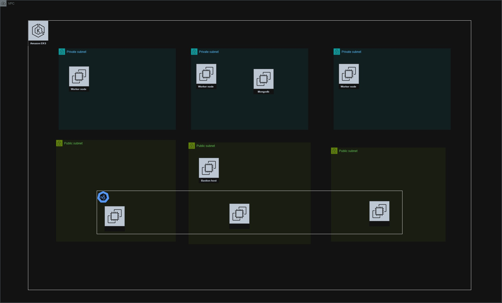

# ✋ Bilingual Sign Language Recognition System (Arabic & English)

A full-stack, production-grade sign language recognition system using real-time webcam input, YOLOv8 deep learning models, and an automated CI/CD pipeline powered by Jenkins, Docker, Kubernetes, ArgoCD, and Terraform.

---

## 🧠 Project Architecture



---

## 📁 Project Structure

```
Jenkins-pipeline/
├── arabic/                 # Arabic model service (Flask + YOLOv8)
├── english/                # English model service (Flask + YOLOv8)
├── frontend/               # Flask gateway + HTML UI
├── Jenkinsfile             # Jenkins pipeline with ArgoCD deployment
├── Kubernetes/             # YAML manifests for services and deployments
└── Terraform/              # IaC scripts for AWS infrastructure
```

---

## 🧠 Technical Overview

### 🔤 Dual YOLOv8 Inference Services
- Flask APIs that load YOLOv8 `.pt` models
- Accepts base64 image via POST, returns highest confidence character

### 🌍 Frontend Service
- Flask app + HTML interface
- Captures webcam image, selects language, sends to respective backend

### 🔁 Component Communication
- Internal DNS in Kubernetes (`arabic-service`, `english-service`)
- Frontend Flask uses `requests.post()` to backend APIs

---

## 🚀 CI/CD Pipeline with Jenkins + ArgoCD

### Jenkinsfile Pipeline Stages

1. **SCM Checkout** – Clones this Git repo
2. **Docker Build & Push** – Builds and pushes images for:
   - `arabic/`
   - `english/`
   - `frontend/`
3. **YAML Update** – Updates image tags in K8s manifests and commits back to Git
4. **ArgoCD Sync** – ArgoCD detects Git change and applies updated manifests
5. **Health Checks** – Waits for healthy ArgoCD app status

### ArgoCD Integration

- Jenkins uses `argocd` CLI to:
  - Login with token
  - Sync the app (`sign-lang-app`)
  - Wait for rollout completion
- Enables GitOps-style automated deployments from versioned YAML

---

## 🐳 Dockerized Microservices

Each component of the system is containerized using Docker:

- **Arabic Backend** (`arabic/`): YOLOv8 Flask API in Docker
- **English Backend** (`english/`): YOLOv8 Flask API in Docker
- **Frontend** (`frontend/`): Flask + HTML UI in Docker


## ☁️ Infrastructure with Terraform

Terraform automates cloud provisioning:

- EKS cluster for Kubernetes workloads
- VPC, security groups, subnets

## ☁️ Orchestration with Kubernetes
- Deployments for the backend and frontend
- ClusterIP services for the communication between the frontend and backend
- Loadblancer service that allows users to communicate with the frontend through port 80

Terraform automates cloud provisioning:

- EKS cluster for Kubernetes workloads
- VPC, security groups, subnets


